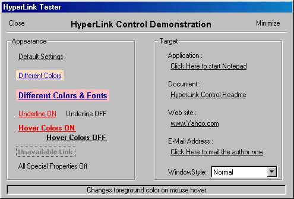



## HyperLink Control

### Description

Add HyperLinks to your VB programs easily! Control Itself manages to open the target - any Program, Document, Web Address, Email Address.....are fully supported.

Looks like a real web Hyperlink, uses appropriate mouse pointers, underlines or changes the font color on mouse hover. Provides < Extended Mouse Events > like MouseHOVER, MouseLEAVE and RightClick.

New programmers can learn many things....(1) How to open any document or URL in its default associated program....(2) How to give mouse hover events in VB controls, and many more.

A very useful and handy control, please vote or comment it.
 
### More Info
 

             |
---                |---
**Submitted On**   |2001-12-23 10:55:00
**By**             |[Shekhar Somani](https://github.com/Planet-Source-Code/PSCIndex/blob/master/ByAuthor/shekhar-somani.md)
**Level**          |Advanced
**User Rating**    |4.7 (33 globes from 7 users)
**Compatibility**  |VB 5\.0, VB 6\.0
**Category**       |[Custom Controls/ Forms/  Menus](https://github.com/Planet-Source-Code/PSCIndex/blob/master/ByCategory/custom-controls-forms-menus__1-4.md)
**World**          |[Visual Basic](https://github.com/Planet-Source-Code/PSCIndex/blob/master/ByWorld/visual-basic.md)
**Archive File**   |[HyperLink\_4370312232001\.zip](https://github.com/Planet-Source-Code/shekhar-somani-hyperlink-control__1-30057/archive/master.zip)

